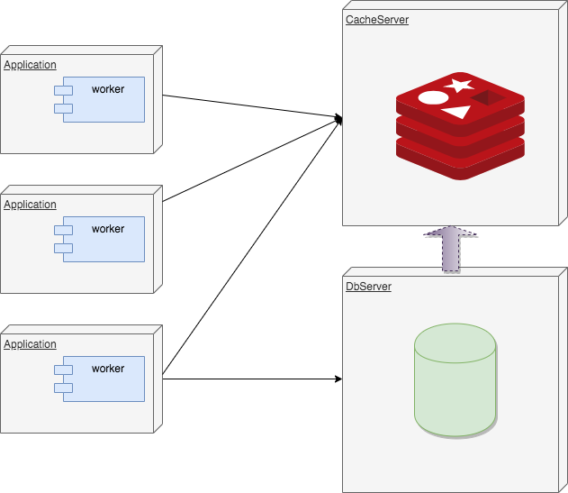
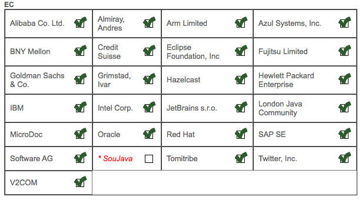
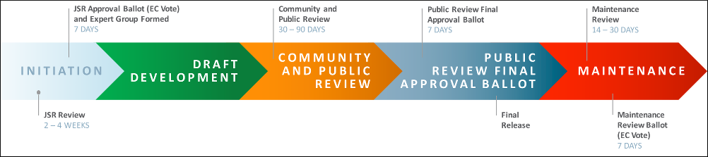
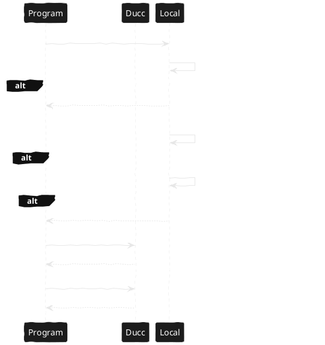
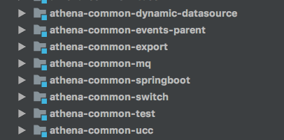

<!-- slide -->

## 背景

### 单一的数据库依赖
### 集中的压力

<!-- slide -->

## 几种基本思路

<!-- slide -->

### 压力分散

<!-- slide -->

### 不依赖数据库

<!-- slide -->

## 方案迭代

<!-- slide -->

### 主动型
* 每个节点有一个Worker
* 每个worker轮询Redis中是否有最新的版本缓存
* 一旦有更新的消息，worker会尝试获取锁把数据放入到缓存

<!-- slide -->

### 优点
* 能够及时的获取到最新的cache
### 缺点
* 每个实例需要维护一个活动线程
* 不能形成通用的解决方案
* 对现有系统的侵入性较大

<!-- slide -->

### 被动型 - 完全被动型
* 每个节点不进行轮询
* 每个节点依然监听消息
* 每个节点拿到变更消息后，都会尝试获取锁，把数据同步到redis
* 获取不到锁的，等待并定期轮询

<!-- slide -->

### 优点
* 能够及时的获取到最新的Cache
* 不需要有后台线程一直进行轮询的操作（接到消息的情况除外）
### 缺点
* 需要有线程进行等待
* 只能接受到一次消息，不利于补偿的处理
* 在体系之外缓存体系之内的东西，需要大量的代码改造

<!-- slide -->

### 被动型 - 主动补偿型
* 提供了一个Zookeeper的通知接口
* 整体缓存更新会分为两个阶段RELOAD、SYNC
* 当收到RELOAD通知的时候，会尝试获取锁，把数据从数据库加载到缓存
* 获取不到锁的，直接放弃退出
* RELOAD完毕后，会在当前节点发出SYNC通知
* 所有的节点接收到SYNC通知后，把redis的数据拉取到本地

<!-- slide -->

## 设计
* 通过方法注解构建从数据库拉取数据的方法代理
* RELOAD时，如果获取到锁，代理会拉取数据放入到缓存
* SYNC时，会直接从缓存拉取数据到本地

<!-- slide -->

### 优点
* 不会涉及到体系内太多的代码，直接在方法级别通过注解进行支持
* 解决了前期迭代的几种方案的弊端
### 缺点
* R2M扛不住

<!-- slide -->

## 多副本改进

<!-- slide -->

基本思路：把压力分散

<!-- slide -->

压力基于时间离散

<!-- slide -->

压力基于副本离散

<!-- slide -->

## 多级缓存的思路
* 通知SYNC的时候，带上可以SYNC的KEY
* 节点遇到KEY才会更新，更新从对应的jsf接口获取数据，如果不是对应的KEY什么也不做

<!-- slide -->

## JSR107


Note:
    * 2001年提交，进行Review

<!-- slide -->



<!-- slide -->

## JSR347
分布式缓存规范

Note:
11年提交，13年投票，15年撤销了

<!-- slide -->

## 捎带点什么。。。

<!-- slide -->

### 规范 & 统一
* 范式，可以作为学习、仿效标准的对象
* 标准，衡量事物的准则
* 社会规范，规定、法则
* 规范场论，规范不变性

<!-- slide -->

### 为什么要封装
* 统一和简化接入形式
* 统一和简化扩展形式

<!-- slide -->

### 我们现在有什么

<!-- slide -->

#### 统一的ducc支持
```java
UccClientOptions uccClientOptions = UccClientOptionsBuilder.builder().appName(appName)
                .token(token)
                .domainAndPort(domainAndPort)
                .namespace(namespace)
                .configName(configName)
                .profileName(profileName)
                .longPolling(60000L)
                .build();

// 添加日志级别动态变更的支持
uccClientOptions.addListener(LogLevelHelper.LOG_LEVEL_CONFIG_CHANGE_LISTENER);

// 添加Listener，方便动态的别名切换
uccClientOptions.addListener(JsfConsumerSwitchSupport.ON_PROPERTY_CHANGE_LISTENER);

UccConfig uccConfig = UccClientHelper.startClient(uccClientOptions);
```

<!-- slide -->

#### 获取属性值
```java
SwitchUtils.get("your-key")
```
过程：

1. 查看本地是否有类似`override.your-key`的配置，有则优先使用
2. ducc中是否有配置`switch.IS_LOCAL_OVERRIDE_ALLOWED=on`，如果有，则看本地是否有"your-key"的配置，如果有，则会使用本地的配置
3. 都没有的，则会使用远程出的配置

<!-- slide -->



<!-- slide -->

#### 获取属性值，带默认值
```java
SwitchUtils.get("your-key", "default value")
```

<!-- slide -->

#### 统一的开关使用形式
```java
SwitchUtils.on("the switch key")
```
* 支持远程配置优先
* 支持远程没有配置相关数据时，优先使用本地配置
* 支持允许本地配置覆盖

***<font color=red>注意：</font>从0.0.5版本开始支持on及true的形式`***

<!-- slide -->

#### 动态日志级别的调整
```java
 // 加入动态日志的listener
uccClientOptions.addListener(LogLevelHelper.LOG_LEVEL_CONFIG_CHANGE_LISTENER);
```
* 形式：`com.jd.baozhang:warn`
* 支持指定IP，指定IP后，只会在对应的IP上打开日志级别
* 支持通过off方便的关闭日志级别的配置

<!-- slide -->

#### 事件总线的统一处理
* 发布
```java
        try {
            EventUtils.pub(new CacheEvent());
        } catch (EventPubException e) {
            e.printStackTrace();
        }
```
* 订阅
```java
        try {
            EventUtils.sub(CacheEvent.class, new EventHandler<CacheEvent>() {
                @Override
                public void handle(CacheEvent event) {
                    System.out.println(event);
                }
            });
        } catch (EventSubException e) {
            e.printStackTrace();
        }
```

<!-- slide -->

#### 依赖配置的统一处理



