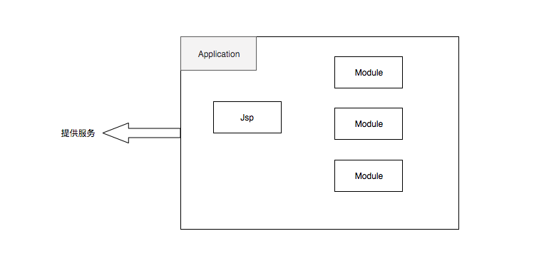
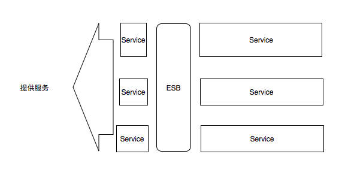
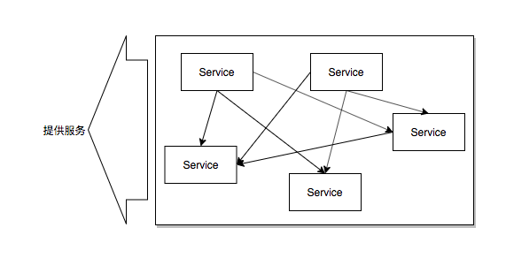
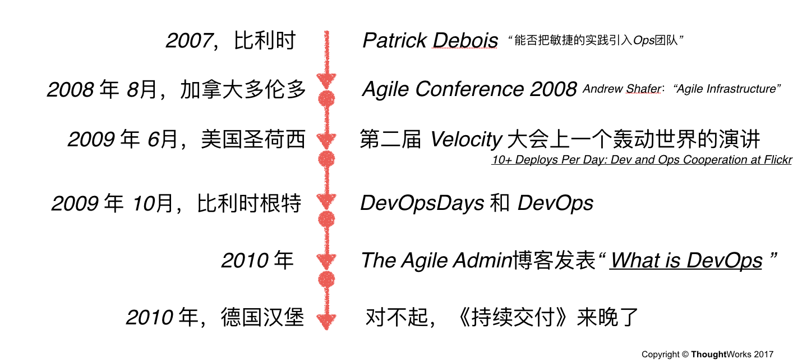
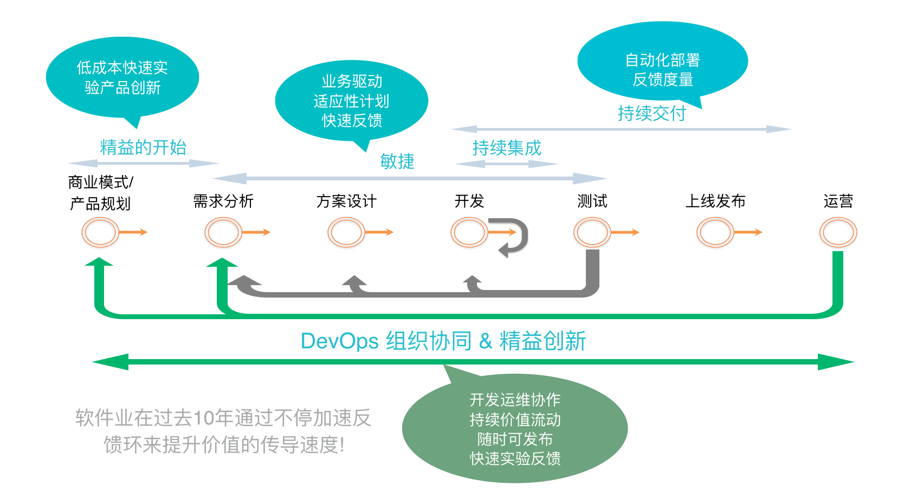
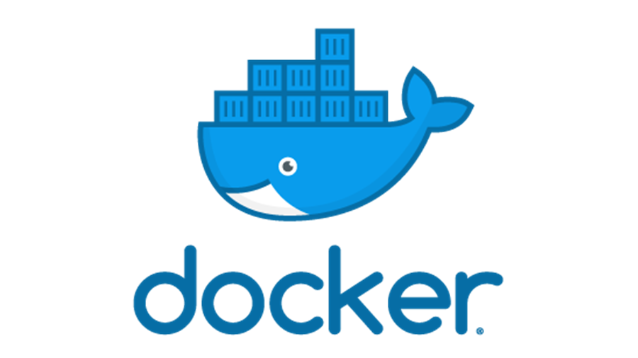
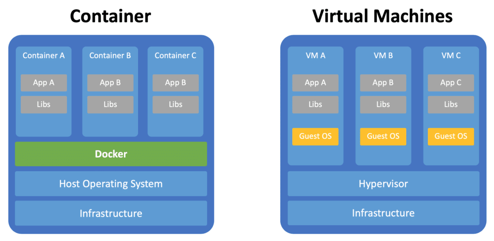

## 10年前

---

## 10年后

---

## MVC

---

## 架构的变更

--

### 单体

--

### SOA

--

### 微服务

---

## 什么是微服务
微服务 (Microservices) 是一种软件架构风格，它是以专注于单一责任与功能的小型功能区块 (Small Building Blocks) 为基础，利用模块化的方式组合出复杂的大型应用程序，各功能区块使用与语言无关 (Language-Independent/Language agnostic) 的 API 集相互通信。

--

微服务的起源是由 Peter Rodgers 博士于 2005 年度云计算博览会提出的微 Web 服务 (Micro-Web-Service) 开始，Juval Löwy 则是与他有类似的前导想法，将类别变成细粒服务 (granular services)，以作为 Microsoft 下一阶段的软件架构，其核心想法是让服务是由类似 Unix 管道的访问方式使用，而且复杂的服务背后是使用简单 URI 来开放接口，任何服务，任何细粒都能被开放 (exposed)。这个设计在 HP 的实验室被实现，具有改变复杂软件系统的强大力量。

--

2014年，Martin Fowler 与 James Lewis 共同提出了微服务的概念，定义了微服务是由以单一应用程序构成的小服务，自己拥有自己的行程与轻量化处理，服务依业务功能设计，以全自动的方式部署，与其他服务使用 HTTP API 通信。同时服务会使用最小的规模的集中管理 (例如 Docker) 能力，服务可以用不同的编程语言与数据库等组件实现。

---

## 挑战
- 怎样快速适应多服务的并行开发测试
- 如何合理规划我们的服务
- 如何保证数据的一致性
- 如何保证服务间通信的易用性、可用性、可靠性
- 如何进行统一的身份认证、服务路由、流量控制、日志统计
- 如何治理海量的服务，包括服务的管理、检测、跟踪
- 如何保证服务的可用性和可靠性

---

## DevOps

--

## 核心
- 更短的交付周期
- 更快的反馈
- 更好的质量

--

## 落地
- 质量体系的建设
- 持续集成部署
- 应用管理和监控
- 度量与反馈
- 统一的环境管理
- 松耦合的架构导向

--

---

## Docker

--

### Dover VS Vitual Machine

--

### 物理机

--

### 虚拟机

--

### 容器

---
