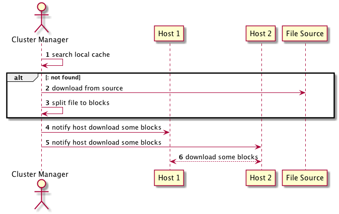

## Harbor

---

### 目标
帮助用户迅速搭建一个企业级的Docker registry服务

---

### 企业级需要什么
- 权限
- 多租户
- HA
- 安全
- 。。。

---

### 架构

---

### 包含的组件
- Proxy
- Registry
- RegistryCtl
- Adminserver
- Core
- Portal
- JobService
- Log
Note:
- Adminserver: 系统管理接口,主要是系统配置，系统信息等
- Core: 一些核心功能，域模型管理，审计，授权，同步，日志等
- Portal: 前端界面
- JobService: 主要是在镜像同步时使用
- Log: 统一管理Harbor的日志

---

### 关键能力
- 用户管理 & 权限控制
    - 支持AD/LDAP的集成
- 镜像复制 & 策略配置
- 安全扫描（集成：clair，Notary)
- Web UI
- 审计日志
- 提供了Restful API方便集成
- 轻量
- 方便部署
- 支持HA

---

### HA-主从同步

--

---

### HA-双主复制

---

### HA-共享存储

---

### 认证过程

---

## 蜻蜓

---

### 背景
- 2015年阿里系统的日均发布量突破2万
- 各种IDC的大量的客户端消耗了巨大的网络带宽

---

### 目标
- Host间组p2p网，节约IDC带宽资源
- 万台同时下载不会带来太大的波动
- 跨国下载加速和带宽节约
- 大文件下载问题，支持断点续传
- 节点IO可控，避免对业务造成影响

---

### 架构

---

### 组件及工具
- Config Service: 管理所有的Cluster Manager，客户端节点路由、系统配置管理、预热服务等等，实际就是让每个Host知道离他最近的Cluster Manager列表
- Cluster Manager: 
    - 以被动方式从CDN下载源文件，同时生成一组种子分块数据
    - 构建P2P网络，调度Peer之间互传指定的分块数据
- dfget: 类似wget，用来完成文件下载
- StarAgent: 用于给dfget下发指令，可使一组机器同时下载文件
- SDK: 可以通过程序将文件push到一组机器上

---

### 下载示意图

Note:
- 两个机器同时调用dfget

---

### 交互过程

Note:
- 断点续传
- MD5校验
- 预热场景，会提前将文件推送到CM端

---

### 性能对比

Note:
- X轴客户端数量，Y轴下载时长

---

## 我们要做什么

---

### 组件
- UI: 前端界面
- jdocker-registry: 后端服务
- Mysql: 数据存储
- Redis: 数据缓存

---

### 一期 3w
- 用户登录授权
- 空间管理：名称、描述、私有或者公有
- 空间授权：给组或者个人授权（admin,pull,push)
- 镜像授权：给组或者个人授权（admin,pull,push)
- 共享镜像存储：jss云存储
- 审计日志：用户的操作记录，包括配置管理镜像操作等

---

### 二期 1w
- 镜像操作统计(pull，push)
- 镜像过滤：namespace,imagename,tag过滤
- 镜像热度：（展示各个镜像的pull,push对比）
- 提取Dockerfile

---

### 三期 1w
- 安全扫描：超过一定安全级别的镜像不能pull
- 支持通过Dockerfile编译镜像
- 支持设置callback：pull,push等事件

---

### 后续